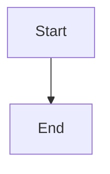

# Architecture Diagrams

This directory contains architectural diagrams for the project using Mermaid format.

## Why Mermaid?

- GitHub renders natively (instant preview)
- VSCode plugin support
- Plain text (version controllable, diffable)
- AI-friendly (easy to generate/modify)
- No additional tools required

## Quick Start

### Viewing Diagrams

**On GitHub:** Just open any `.md` file - diagrams render automatically

**In VSCode:**
1. Install extension: `Markdown Preview Mermaid Support`
2. Open any diagram file
3. Press `Ctrl+Shift+V` (or `Cmd+Shift+V` on Mac)

### Creating New Diagrams

Create a new `.md` file with:

```markdown
# Diagram Title


```

## Diagram Types Supported

- **Flowchart:** System flows, process diagrams
- **Sequence:** Interaction between components
- **Class:** Data models, domain models
- **State:** State machines
- **ER:** Entity relationships
- **C4:** Context and container diagrams

## Examples

See `mermaid/examples/` directory for templates.
