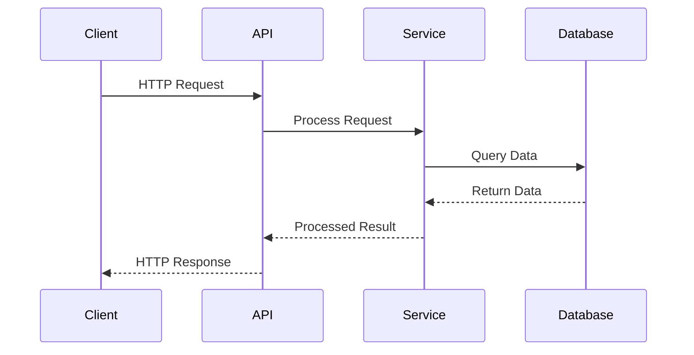

# Component Flow Diagram

Shows the flow of data/requests between internal components.

```mermaid
sequenceDiagram
    participant Client
    participant API
    participant Service
    participant Database

    Client->>API: HTTP Request
    API->>Service: Process Request
    Service->>Database: Query Data
    Database-->>Service: Return Data
    Service-->>API: Processed Result
    API-->>Client: HTTP Response
```

**When to update:** When adding new components or changing interaction patterns.
