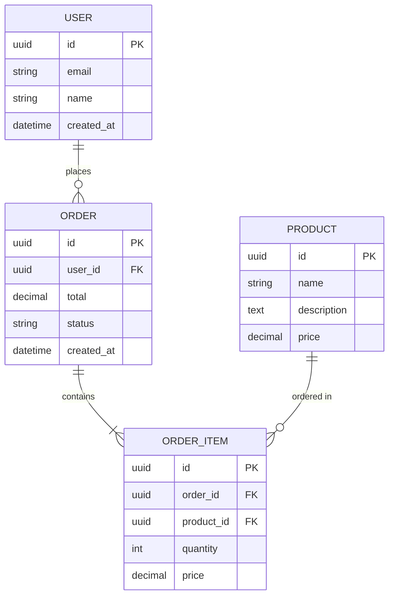

# Data Model Diagram

Core entities and their relationships.

```mermaid
erDiagram
    USER ||--o{ ORDER : places
    USER {
        uuid id PK
        string email
        string name
        datetime created_at
    }
    ORDER ||--|{ ORDER_ITEM : contains
    ORDER {
        uuid id PK
        uuid user_id FK
        decimal total
        string status
        datetime created_at
    }
    ORDER_ITEM {
        uuid id PK
        uuid order_id FK
        uuid product_id FK
        int quantity
        decimal price
    }
    PRODUCT ||--o{ ORDER_ITEM : "ordered in"
    PRODUCT {
        uuid id PK
        string name
        text description
        decimal price
    }
```

**When to update:** When adding/modifying database entities or relationships.
