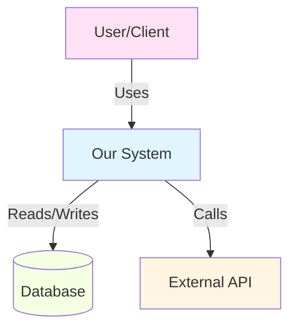

# System Context Diagram

High-level view of the system and its external dependencies.

```mermaid
graph TB
    User[User/Client]
    System[Our System]
    Database[(Database)]
    ExternalAPI[External API]

    User -->|Uses| System
    System -->|Reads/Writes| Database
    System -->|Calls| ExternalAPI

    style System fill:#e1f5ff
    style User fill:#ffe1f5
    style Database fill:#f5ffe1
    style ExternalAPI fill:#fff5e1
```

**When to update:** When adding new external systems or major system boundaries change.
